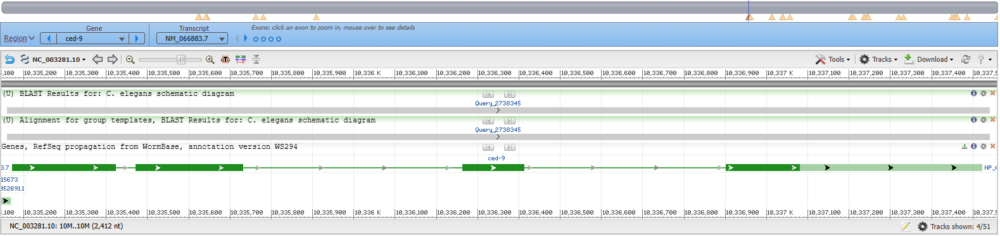
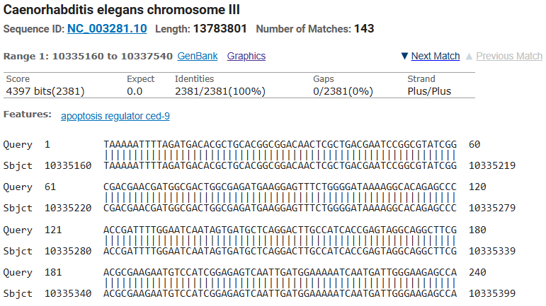
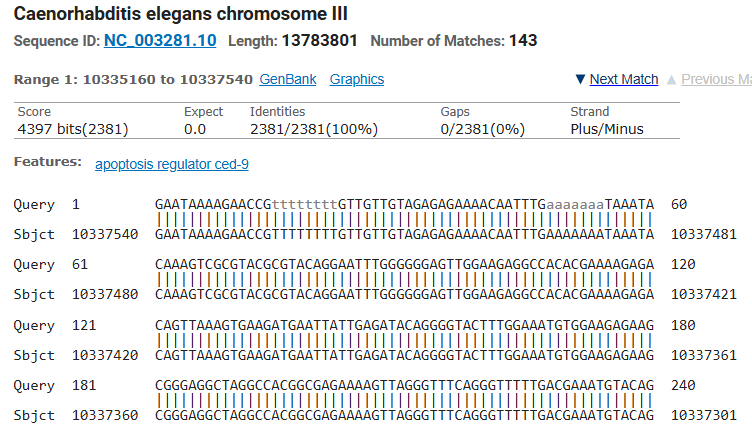
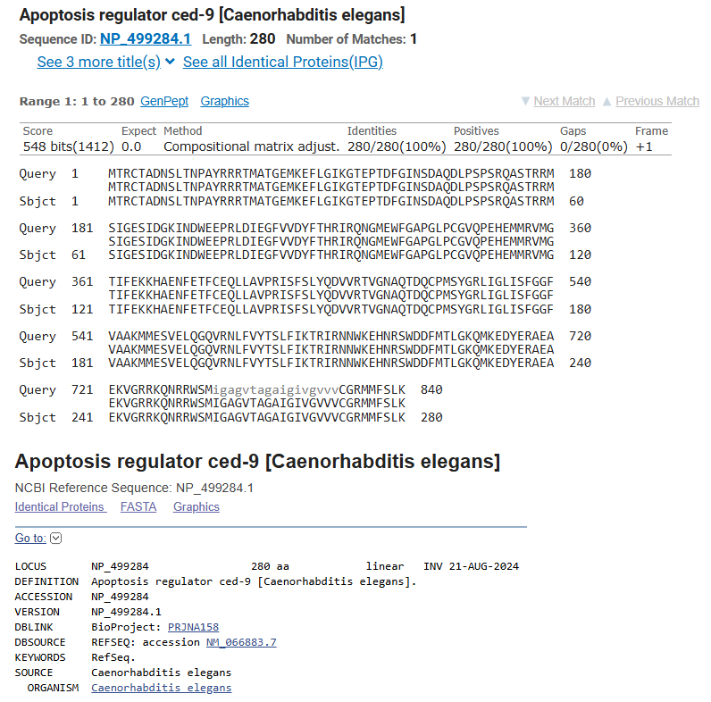

<!-- page number pos -->
\fancyhf{}
\fancyfoot[C]{\thepage}
\pagestyle{fancy}

<!-- no page nr on first page  -->
\pagenumbering{gobble}

<!-- Anger sidbrytning -->
\clearpage

<!-- creating the table of contents -->
\setcounter{tocdepth}{3}
\tableofcontents

<!-- new page -->
\clearpage

<!-- starting the count on 1 after the contents -->
\pagenumbering{arabic}
\setcounter{page}{1}

```{r setup, include=FALSE}
knitr::opts_chunk$set(echo = TRUE, message = FALSE, warning=FALSE, fig.width = 6, fig.height = 4)
```


```{r}
library(seqinr)
library(stringr)
```


# Hardy–Weinberg equilibrium

We consider a gene locus with two possible alleles (say A and a) and a diploid population with
N individuals. Hence, there are 2N alleles in the population. Let p be the proportion of As in
the allele population and q the population of as (of course p + q = 1). A population is said to
be in Hardy–Weinberg equilibrium if the proportion of AA homozygotes is p
2, aa homozygotes is q2 and the proportion of heterozygotes (Aa) is 2pq.


## Question 1.1

Show that with random mating (i.e. both alleles of the offspring are just randomly, with proportions p and q, drawn from the parental allele population) Hardy–Weinberg equilibrium is attained in the first generation. What is the proportion of A and a alleles in the offspring population? Hence, with random mating, can a population in Hardy–Weinberg equilibrium ever deviate from it?


$$P(AA) = p^2$$

$$P(Aa) = 2pq$$

$$P(aa) = q^2$$

$$p_{offspring} = p$$

$$q_{offspring} = q$$


When its random mating the proportions will always stay the same for the next generation because the allele frequencies are preserved.

## Question 1.2

We look at the MN blood group (https://en.wikipedia.org/wiki/MNS_antigen_system), it has two possible co–dominating (both contribute to heterozygotes) alleles L M (denoted M) and L N (denoted N). In a population of 1000 Americans of Caucasian descent the following genotype counts were observed, 357 individuals were MM, 485 were MN and 158 were NN. Use a chi– square goodness of fit test to test if the population is in Hardy–Weinberg equilibrium.

chi– square goodness of fit test:

$$ \chi ^2 = \sum \frac{(O_i - E_i)^2}{E_i} $$

$$df = 3 -1 $$

$$p-value = P (\chi ^2 > Observed \chi ^2)$$


```{r}
# data
MM <- 357
NM <- 485
NN <- 158

# all M's

p <- (2*MM+NM)/(2*1000)
q <- 1-p

# expected values
exp_mm <-p*p*1000
exp_nm <-2*p*q*1000
exp_nn <- q*q*1000

# built in function
# chisq.test(c(MM,NM,NN), p=c(p*p,2*p*q,q*q))
act <- c(MM,NM,NN)
expected <- c(exp_mm,exp_nm,exp_nn)

# Calculate Chi-Square statistic manually
chi_sq_statistic <- sum((act-expected)^2 / expected)

df <- 3-1
p_value <- 1 - pchisq(chi_sq_statistic, df)

p_value
```

The p-value is very high, which indicates that there is no significant difference between the groups and we cant reject that the population is in Hardy–Weinberg equilibrium. 

\newpage


# Question 2: Exploring a genomic sequence

In this exercise, you will use GenBank (https://www.ncbi.nlm.nih.gov/genbank/) with the
default “Nucleotide” database. We will be interested in the sequence with accession number in
GenBank: MK465080. You will find the relevant information in the FEATURES section of the
returned record and access the nucleotides of the sequence under CDS (protein coding sequence,
from CoDing Sequence). Remember that the coding strand (https://en.wikipedia.org/wiki/Coding_strand) is the strand of the gene that is identical to the transcript (see the lecture slides
for the genetic code—translation of DNA triples to amino acids). The complimentary to it strand
is called the template strand.

## Question 2.1

From what species does the sequence come from? Name the protein product of the CDS.


The protein product of the CDS is "cytochrome c oxidase subunit I"(COI) and the species is branchipus schaefferi, which seem to be a kind of crustacean.

## Question 2.2

```{r}
# importing fasta file

branchipus <- read.fasta('branchipus_schaefferi.fasta')

sequence <- branchipus$MK465080.1
print(branchipus)

```


Save (and submit) the nucleotide sequence of the coding strand that corresponds to these amino
acids as a FASTA format file.. Use transeq (https://www.ebi.ac.uk/Tools/st/emboss_transeq/) to translate the nucleotides to a protein. Do you obtain the same protein sequence?
Check what is the ORF and codon table (these are provided by GenBank in the FEATURES
section). Use backtranseq (https://www.ebi.ac.uk/Tools/st/emboss_backtranseq/) to obtain the sequence from the protein sequence.

Using frame 2 and codon table 5 'Invertebrate Mitochondrial'.

```{r}

branchipus_2 <- read.fasta('emboss_transeq-I20241115-093926-0606-64392434-p1m.fasta')
seqq <- branchipus_2$MK465080.1_2
print(seqq)


true_seq <- str_split(tolower("LLGDDQLYNVIVTAHAFVMIFFMVMPILIGGFGNWLVPLMLGAPDMAFPRLNNLSFWMLPPSLTLLVASSMVESGVGTGWTVYPPLSAAIAHAGPSVDLAIFSLHLAGISSILGAVNFITTVINMRPHSMSLDRMPLFAWAVVITAVLLLLSLPVLA"),'')[[1]]

print(true_seq==seqq)


```

We  get the same protein sequence as this is the sequence from https://www.ncbi.nlm.nih.gov/nuccore/MK465080 .

"LLGDDQLYNVIVTAHAFVMIFFMVMPILIGGFGNWLVPLMLGAPDMAFPRLNNLSFWMLPPSLTLLVASSMVESGVGTG
WTVYPPLSAAIAHAGPSVDLAIFSLHLAGISSILGAVNFITTVINMRPHSMSLDRMPLFAWAVVITAVLLLLSLPVLA"

Then in the end of the sequence we got there is an X which i guess is a stop codon.

To use backtranseq we couldn't find the correct codon table so we use 'Homo ' Sapiens' and got the following results. 

```{r}
branchipus_3 <- read.fasta('emboss_backtranseq-I20241115-101532-0798-77094578-p1m.fasta')

code_seq <- branchipus_3$MK465080.1_2
print(code_seq)


```

We get a different sequence compared to the one we saved from https://www.ncbi.nlm.nih.gov/nuccore/MK465080.1?report=fasta.

## Question 2.3

Compare your obtained coding strand sequence with the nucleotide sequence provided (when
following the CDS link). Are they the same or do they differ? Try reversing and taking the complement (e.g., http://arep.med.harvard.edu/labgc/adnan/projects/Utilities/revcomp.html or http://www.bioinformatics.nl/cgi-bin/emboss/revseq or write your own code)
of the your coding strand DNA. Consider also backtranseqambiq (https://www.ebi.ac.uk/Tools/st/emboss_backtranseqambig/ and check if the resulting nucleotide sequence is compatible with the true one. Do not forget to check the codon table. Explain what happened and
why. Save (and submit) the nucleotide sequence of the template strand that corresponds to these
amino acids as a FASTA format file.


Results from backtranseqambiq with codon table 5 'Invertebrate Mitochondrial'.

```{r}
branchipus_4 <- read.fasta('emboss_backtranambig-I20241115-101314-0071-49255505-p1m.fasta')

print(branchipus_4$MK465080.1_2)

```


Results from backtranseqambiq with codon table 5 'Invertebrate Mitochondrial'

reverse and complemented sequence:
"""GATCATCACGAAGGCGTGGGCGGTCACGATCACGTTGTACAGCTGGTCGTCGCCCAGCAG
CATCAGGGGCACCAGCCAGTTGCCGAAGCCGCCGATCAGGATGGGCATCACCATGAAGAA
GGGCAGCATCCAGAAGCTCAGGTTGTTCAGCCTGGGGAAGGCCATGTCGGGGGCGCCCAG
CCAGCCGGTGCCCACGCCGCTCTCCACCATGCTGCTGGCCACCAGCAGGGTCAGGCTGGG
GGCCAGGTCCACGCTGGGGCCGGCGTGGGCGATGGCGGCGCTCAGGGGGGGGTACACGGT
GGTGATGAAGTTCACGGCGCCCAGGATGCTGCTGATGCCGGCCAGGTGCAGGCTGAAGAT
CCAGGCGAACAGGGGCATCCTGTCCAGGCTCATGCTGTGGGGCCTCATGTTGATCACGGT
NNNGGCCAGCACGGGCAGGCTCAGCAGCAGCAGCACGGCGGTGATCACCACGGC"""

Results from backtranseqambiq:

"GGNGCNACNTGYGCNACNTGYGCNTGYGGNGCNGCNGGNGGNTGYGGNACNGGNGGNGGN
TGYGGNGGNACNTGYGCNTGYGGNGCNACNTGYGCNTGYGGNACNACNGGNACNGCNTGY
GCNGGNTGYACNGGNGGNACNTGYGGNACNTGYGGNTGYTGYTGYGCNGGNTGYGCNGGN
TGYGCNACNTGYGCNGGNGGNGGNGGNTGYGCNTGYTGYGCNGGNTGYTGYGCNGGNACN
ACNGGNTGYTGYGGNGCNGCNGGNTGYTGYGGNTGYTGYGGNGCNACNTGYGCNGGNGGN
GCNACNGGNGGNGGNTGYGCNACNTGYGCNTGYTGYGCNACNGGNGCNGCNGGNGCNGCN
GGNGGNGGNTGYGCNGGNTGYGCNACNTGYTGYGCNGGNGCNGCNGGNTGYACNTGYGCN
GGNGGNACNACNGGNACNACNTGYGCNGGNTGYTGYACNGGNGGNGGNGGNGCNGCNGGN
GGNTGYTGYGCNACNGGNACNTGYGGNGGNGGNGGNGGNTGYGGNTGYTGYTGYGCNGGN
TGYTGYGCNGGNTGYTGYGGNGGNACNGGNTGYTGYTGYGCNTGYGGNTGYTGYGGNTGY
ACNTGYACNTGYTGYGCNTGYTGYGCNACNGGNTGYACNGGNTGYACNGGNGGNTGYTGY
GCNTGYTGYGCNGGNTGYGCNGGNGGNGGNACNTGYGCNGGNGGNTGYACNGGNGGNGGN
GGNGGNTGYTGYGCNGGNGGNACNTGYTGYGCNTGYGGNTGYACNGGNGGNGGNGGNTGY
TGYGGNGGNTGYGGNACNGGNGGNGGNTGYGGNGCNACNGGNGGNTGYGGNGGNTGYGGN
TGYACNTGYGCNGGNGGNGGNGGNGGNGGNGGNGGNACNGCNTGYGCNTGYGGNGGNACN
GGNGGNACNGGNGCNACNGGNGCNGCNGGNACNACNTGYGCNTGYGGNGGNTGYGGNTGY
TGYTGYGCNGGNGGNGCNACNGGNTGYACNGGNTGYACNGGNGCNACNGGNTGYTGYGGN
GGNTGYTGYGCNGGNGGNACNGGNTGYGCNGGNGGNTGYACNGGNGCNGCNGGNGCNACN
TGYTGYGCNGGNGGNTGYGGNGCNGCNTGYGCNGGNGGNGGNGGNTGYGCNACNTGYTGY
ACNGGNACNTGYTGYGCNGGNGGNTGYACNTGYGCNACNGGNTGYACNGGNACNGGNGGN
GGNGGNTGYTGYACNTGYGCNACNGGNACNACNGGNGCNACNTGYGCNTGYGGNGGNACN
AAYAAYAAYGGNGGNTGYTGYGCNGGNTGYGCNTGYGGNGGNGGNTGYGCNGGNGGNTGY
ACNTGYGCNGGNTGYGCNGGNTGYGCNGGNTGYGCNGGNTGYGCNTGYGGNGGNTGYGGN
GGNACNGGNGCNACNTGYGCNTGYTGYGCNTGYGGNGGNTGY"


Does not look close to the true sequence have in the fasta file were supposed to save. The reason we think is behind this is that the codon table that we have used does not correspond to the protein sequence of the species, making it fail at transcribing the nucleotide sequence to the correct sequence. We also gets lots of N's, this is because backtranseqambiq tries to cover all possible codon options, as N stands for any nucleotide (A,T,G,C), Y also stand for either Cytosine or Thymine, these ambiguities make the resulting sequence less specific and harder to compare directly with the true nucleotide sequence.

\newpage

# Question 3: Exploring a genomic sequence

Eukaryotic genes are commonly divided into exons and introns and these needed to be spliced in
order to produce an mRNA that can be translated into a protein. The gene starts with the promoter (“region of DNA that initiates transcription, i.e. DNA→RNA, of a particular gene”, see
https://en.wikipedia.org/wiki/Promoter_(genetics)), the the first exon, first intron, second exon, e.t.c. Multiple introns an alternative splicing (a single gene codes for different proteins,
through different exons used, see https://en.wikipedia.org/wiki/Alternative_splicing)
of mRNAs can make it difficult to identify genes. Finding genes and how they are organized
is often due to searching for similar nucleotide sequences within already know protein amino
acids, or rather their nucleotide sequences and the corresponding full–length cDNAs (complementary DNA—DNA synthesized from a single stranded RNA, see https://en.wikipedia.org/wiki/Complementary_DNA). cDNAs come from back transcription (reverse–transcription)
of mRNAs and hence are without introns—and can be considered as equivalent to mRNA sequences. Comparing a part of the genome (that contains introns) with its cDNA will show the
introns’ start and end points. GenBank (https://www.ncbi.nlm.nih.gov/genbank/) contains
both cDNA sequences and corresponding genomic sequences (if available). If order to discover
the structure of the gene we need to compare the cDNA with the genomic sequence. In the
file 732A51 BioinformaticsHT2024 Lab01Ex03.fasta you can find a genomic sequence from
the species C. elegans, that contains a particular gene. You will use the Basic Local Alignment
Sequence Tool (BLAST), to find the gene’s organization. BLAST is used to compare a query
sequence all sequences (i.e., cDNA sequences) in GenBank. Usually the top scoring hit is the
one you want. The next ones will be less and less similar. It can happen that all hits have 100%
identity—then consider the percent coverage.

## Question 3.1

Read up on C. elegans and in a few sentences describe it and why it is such an important
organism for the scientific community.

C. elegans is a kind of a small, transparent, nematode or roundworm, feeding on microorganisms and it can mate both with males and through self-fertilization. The research started on C elegans as it has multiple advantageous attributes like its transparency, short life span(easy to follow from egg to death) and relative small genome that reproduces quickly. 


\pagebreak
## Question 3.2

```{r}
c_el <- read.fasta('732A51_BioinformaticsHT2024_Lab01Ex03.fasta')
```


Use the nucleotide BLAST tool to construct a schematic diagram that shows the arrangement
of introns and exons in the genomic sequence. In the BLAST tool, https://blast.ncbi.nlm.nih.gov/Blast.cgi?PAGE_TYPE=BlastSearch, choose database RefSeq Genome Database and remember that the species source of the genomic sequence is Caenorhabditis elegans. Use the Genome Data Viewer button. Alternatively you may use https://wormbase.org/tools/blast_blat.



Good sequence alignment found with a max score of 4397 with 100% identities and 0% gaps. 

\pagebreak
## Question 3.3

How are the sequences numbered in the alignment (i.e., pairing of query and database sequences)?
Are the directions the same? What would happen if you reverse complement your query
sequence (e.g., http://arep.med.harvard.edu/labgc/adnan/projects/Utilities/revcomp.html or http://www.bioinformatics.nl/cgi-bin/emboss/revseq or write your own code) and do the search with such a reverse complemented sequence?

The sequences seems to be numbered after the chromosome’s coordinate system, where the start and end positions of the alignment are specific to the reference genome's coordinate structure.



The Strand being Plus/Plus means both sequences move in the same directions, and identities being 100% and gaps 0% means they are aligned well. 

\pagebreak
Reverse complemented sequence is as below:

```{r, results='hide'}
"GAATAAAAGAACCGTTTTTTTTGTTGTTGTAGAGAGAAAACAATTTGAAAAAAATAAATA
CAAAGTCGCGTACGCGTACAGGAATTTGGGGGGAGTTGGAAGAGGCCACACGAAAAGAGA
CAGTTAAAGTGAAGATGAATTATTGAGATACAGGGGTACTTTGGAAATGTGGAAGAGAAG
CGGGAGGCTAGGCCACGGCGAGAAAAGTTAGGGTTTCAGGGTTTTTGACGAAATGTACAG
AACACGGAAAAGTTGATATTACGCGGAAGTAGGGTTTGGCCAAAAAAAAAGGCAATCGGA
AAAAATTGCAGTAAAATCGTAAATCGACACAGAGAGCCGTAATTTGTGGCCTAGCTTTCC
CACTTCTTCCAGTTCAAAGGATGAGAGAATCAGTGAGCAAAAATGAGATTCAAATGTAAG
GAGTTGTACATAAATTAATTATTTACACAAATTGAATACGTTACTTCAAGCTGAACATCA
TCCGCCCACACACGACGACTCCAACGATTCCAATGGCTCCAGCTGTTACTCCAGCGCCAA
TCATCGACCACCGTCTGTTCTGCTTCCGGCGTCCCACTTTTTCAGCTTCTGCTCGTTCGT
AGTCCTCTTTCATTTGTTTTCCGAGTGTCATGAAGTCGTCCTGCAATTTTTTTCTTGATT
TTTTATTTTCACAAATAATGCTTTAGAGCATATTCCGGGGAACACAAAAATCCGTGAATG
CGTATTTCACAACATATTTGAGGCGGAAATATCTCGTAGCGAAAACTACAGTAATTCTTT
AAATGCCTACTGTAGTCGATTTACGGGCTCGATTTTTGAAATTAATTTCTTTTGATTAGT
GGTTATTTTCTTTAATTGTAAAAATTTTAAAAATTTAAAGAATTACTGTAGTTTTCTCTA
CTGGATATTTTGCGCGTCAAATATGTTGTGAAATACGCATTCTGCGAATTTTGTATTCCC
GTAACAATAACATTATCATAAACAGTAATATACTTGAATATGTTTCCAGCTGTCCCCCCA
AGAGGCTACCGAACCCTGTAATTATCGGCTTACCAACACCCCGGGAAGTCAAGGGTACTA
GGGAAAGGGGGATATTGACTTCTAATGTCTATGCAAATACTCCTTACCCAGCTCCGATTG
TGTTCCTTCCAGTTGTTGCGGATCCGCGTTTTGATGAACAGCGATGTGTAAACGAAGAGG
TTTCGCACTTGTCCCTGCAGTTCCACGGATTCCATCATTTTTGCAGCTACGAAACCGCCG
AACGAGATTAGACCTATCTGAAAATTAGAAATTTGCAATTTAATTCGTTCATTTCTGGCG
GAAAATTAAGCTTAAAAAAACGATTTTTCTGGTTTTTAATGTTCGAAAATTGAATTTTTG
GGGTTTTTCGTTCAGCAAATCAGCAGAAAAACCTGTTTTTCGAAGAAAAAAGTTCAAAAA
TCGAATTTTAATGTATTTTCCACAAATTTTACATTTAAAAACCGATTTTTGATAAATCAG
CAGATCTTTTTCGCAAATACAAATCAAGGAAAATATGCTTTAAAAATATTCGAATAGAAA
ATAACGTTTTTAATCGAATTCGTAAAGTTTTCTGCTAATTTATCAACAAAAAAAATTACA
ATCCGGGATCAAAATTCGTGGTTTTTTAATGGAAAACTTTCAAAAAAGACACATAATTGG
GCTATTTTTGACCAAGTTTTGCTGATTTCCTGAAGGAAAACAAACAATTTTTGCAAATGT
TTTTTCTGCCACCTTTCTGGCGAATTTTCGAATTTTTGCAAACTTTTTTTCAGTATTTTC
TCCCTTACCAAACGTCCATAAGACATTGGACATTGATCTGTCTGTGCATTTCCAACCGTC
CGAACCACATCCTGATACAGTGAAAATGAGATTCTGGGCACTGCGAGCAGCTGCTCACAG
AAGGTCTCAAAATTTTCCGCGTGCTTCTTCTCGAATATCGTTCCCATAACTCGCATCATT
TCGTGCTCCGGTTGCACTCCACACGGCAATCCCGGTGCTCCAAACCATTCCATTCCGTTT
TGCCGGATTCGGTGCGTGAAATAGTCGACCTGGAAGCAGCAGGAAATTTTATTTACAAAA
AAAAATTAAAAAATTACCACAAATCCCTCGATATCAAGCCTTGGCTCTTCCCAATCATTG
ATTTTTCCATCAATTGACTCTCCGATGGACATTCTTCGCGTCGAAGCCTGCCTACTCGGT
GATGGCAAGTCCTGAGCATCACTATTGATTCCAAAATCGGTGGGCTCTGTGCCTTTTATC
CCCAGAAACTCCTTCATCTCGCCAGTCGCCATCGTTCGTCGCCGATACGCCGGATTCGTC
AGCGAGTTGTCCGCCGTGCAGCGTGTCATCTAAAATTTTTA"
```




Reversing and complementing the sequence results in the strands being Plus/Minus which is expected as they now move in different directions. However, identities and gaps are still maintained and thus they are still aligned.

## Question 3.4

On what chromosome and what position is the query sequence found? At which position does
the gene begin and end in your query sequence?

The query sequence is found on chromosome III at positions 10335160 to 10337540. 

\pagebreak
## Question 3.5

Extract the DNA code of each exon and using transeq (https://www.ebi.ac.uk/Tools/st/
emboss_transeq/) find the protein code of the gene. You can also use blastx (https://blast.
ncbi.nlm.nih.gov/Blast.cgi?PROGRAM=blastx&PAGE_TYPE=BlastSearch&LINK_LOC=blasthome
or https://wormbase.org/tools/blast_blat) to obtain protein sequences. How do they compare to your translation?

Below is the extracted combined DNA code for all 4 exons.

```{r, results='hide'}
"ATGACACGCTGCACGGCGGACAACTCGCTGACGAATCCGGCGTATCGGCGACGAACGATGGCGACTGGCG
AGATGAAGGAGTTTCTGGGGATAAAAGGCACAGAGCCCACCGATTTTGGAATCAATAGTGATGCTCAGGA
CTTGCCATCACCGAGTAGGCAGGCTTCGACGCGAAGAATGTCCATCGGAGAGTCAATTGATGGAAAAATC
AATGATTGGGAAGAGCCAAGGCTTGATATCGAGGGATTTGTGGTCGACTATTTCACGCACCGAATCCGGC
AAAACGGAATGGAATGGTTTGGAGCACCGGGATTGCCGTGTGGAGTGCAACCGGAGCACGAAATGATGCG
AGTTATGGGAACGATATTCGAGAAGAAGCACGCGGAAAATTTTGAGACCTTCTGTGAGCAGCTGCTCGCA
GTGCCCAGAATCTCATTTTCACTGTATCAGGATGTGGTTCGGACGGTTGGAAATGCACAGACAGATCAAT
GTCCAATGTCTTATGGACGTTTGATAGGTCTAATCTCGTTCGGCGGTTTCGTAGCTGCAAAAATGATGGA
ATCCGTGGAACTGCAGGGACAAGTGCGAAACCTCTTCGTTTACACATCGCTGTTCATCAAAACGCGGATC
CGCAACAACTGGAAGGAACACAATCGGAGCTGGGACGACTTCATGACACTCGGAAAACAAATGAAAGAGG
ACTACGAACGAGCAGAAGCTGAAAAAGTGGGACGCCGGAAGCAGAACAGACGGTGGTCGATGATTGGCGC
TGGAGTAACAGCTGGAGCCATTGGAATCGTTGGAGTCGTCGTGTGTGGGCGGATGATGTTCAGCTTGAAG
TAACGTATTCAATTTGTGTAAATAATTAATTTATGTACAACTCCTTACATTTGAATCTCATTTTTGCTCA
CTGATTCTCTCATCCTTTGAACTGGAAGAAGTGGGAAAGCTAGGCCACAAATTACGGCTCTCTGTGTCGA
TTTACGATTTTACTGCAATTTTTTCCGATTGCCTTTTTTTTTGGCCAAACCCTACTTCCGCGTAATATCA
ACTTTTCCGTGTTCTGTACATTTCGTCAAAAACCCTGAAACCCTAACTTTTCTCGCCGTGGCCTAGCCTC
CCGCTTCTCTTCCACATTTCCAAAGTACCCCTGTATCTCAATAATTCATCTTCACTTTAACTGTCTCTTT
TCGTGTGGCCTCTTCCAACTCCCCCCAAATTCCTGTACGCGTACGCGACTTTGTATTTATTTTTTTCAAA
TTGTTTTCTCTCTACAACAACAAAA"
```

The protein sequence for the extraced DNA code is on the page below. It has a max score of 548 with 100% identities and 0% gaps, but only 65% query cover. It is identified as the NP_499284.1 protein sequence. Seems to compare well to the translation.



\pagebreak 


## Question 3.6

What gene is in the query sequence? Hovering over an exon you should see links to View GeneID
and View WormBase. These point to pages with more information on the gene. Follow them
and write a few sentences about the gene.

The gene in the query sequence is the ced-9. The official full name is Apoptosis regulator ced-9 which was originated by Jonathan Hodgkin. It is a gene type for protein coding. Enables GTPase activator activity and protein sequestering activity. Involved in several processes, including positive regulation of brood size; positive regulation of cellular component organization; and positive regulation of egg-laying behavior. Located in several cellular components, including mitochondrial outer membrane; neuronal cell body; and perinuclear region of cytoplasm. Is expressed in several structures, including gonad.
