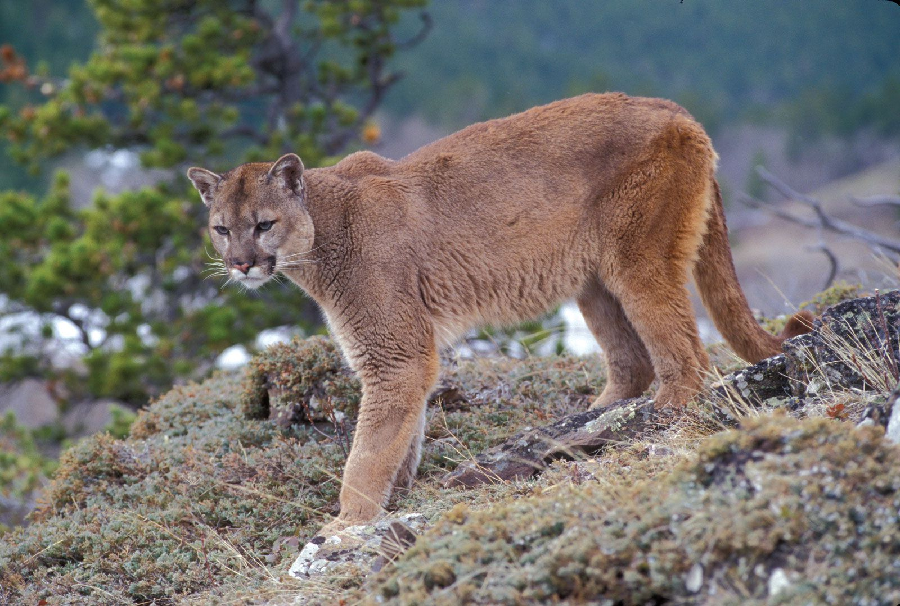
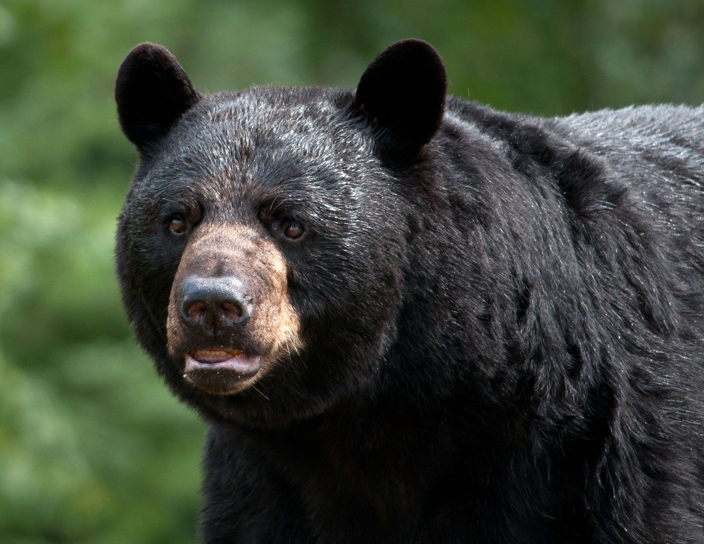

<!-- page number pos -->
\fancyhf{}
\fancyfoot[C]{\thepage}
\pagestyle{fancy}

<!-- no page nr on first page  -->
\pagenumbering{gobble}

<!-- Anger sidbrytning -->
\clearpage

<!-- creating the table of contents -->
\setcounter{tocdepth}{3}
\tableofcontents

<!-- new page -->
\clearpage

<!-- starting the count on 1 after the contents -->
\pagenumbering{arabic}
\setcounter{page}{1}

```{r setup, include=FALSE}
knitr::opts_chunk$set(echo = TRUE, message = FALSE, warning=FALSE, fig.width = 6, fig.height = 4)
```

# Question 1

Using the script http://ape-package.ird.fr/APER/APER2/SylviaWarblers.R obtain the Sylvia warblers phylogeny (the script saves in in the file sylvia nj k80.tre). The geographical range data can be found in http://ape-package.ird.fr/APER/APER2/sylvia_data.txt and in the script is referenced as DF$geo.range. Notice that one tip is removed due to missing data tr <- drop.tip(tr, "Chamaea_fasciata") and the data has to be ordered by the tips of the phylogeny DF <- sylvia.eco[tr$tip.label, ] WARNING: Running the script bare might result in errors and very long running times. Choose only the lines that you actually need!


## The given code(with some changes to get it to work on Windows)

```{r, eval=FALSE}
set.seed(12345)
library(ape)
#remotes::install_github("fmichonneau/phyloch")
###
### Chapter 3
###

x <- paste("AJ5345", 26:49, sep = "")
x <- c("Z73494", x)
sylvia.seq <- read.GenBank(x)

#system("wsl.exe mafft --version")


sylvia.clus <- clustal(sylvia.seq)


# manually running mafft
Sys.setenv(TMPDIR = "C:/Users/wountain/Desktop/SCHOOL/HT24_Bioinformatics/Bioinformatics/lab3")
write.FASTA(sylvia.seq, file = "C:/Users/wountain/Desktop/SCHOOL/HT24_Bioinformatics/Bioinformatics/lab3/mafftin.fas")
system("wsl.exe mafft --localpair --maxiterate 1000 /mnt/c/Users/wountain/Desktop/SCHOOL/HT24_Bioinformatics/Bioinformatics/lab3/mafftin.fas > /mnt/c/Users/wountain/Desktop/SCHOOL/HT24_Bioinformatics/Bioinformatics/lab3/mafftout.fas 2>/mnt/c/Users/wountain/Desktop/SCHOOL/HT24_Bioinformatics/Bioinformatics/lab3/mafft_error.log")

sylvia.maff <- read.dna("C:/Users/wountain/Desktop/SCHOOL/HT24_Bioinformatics/Bioinformatics/lab3/mafftout.fas", format = "fasta")


# /wsl.localhost/Ubuntu
library(phyloch) # /usr/bin/mafft
#sylvia.maff <- mafft(sylvia.seq, path='/usr/bin/mafft')

identical(sylvia.clus[x, ], sylvia.maff[x, ])

taxa.sylvia <- attr(sylvia.seq, "species")
names(taxa.sylvia) <- names(sylvia.seq)
rm(sylvia.seq)
taxa.sylvia[1] <- "Sylvia_atricapilla"
taxa.sylvia[24] <- "Sylvia_abyssinica"

sylvia.eco <- read.table("C:/Users/wountain/Desktop/SCHOOL/HT24_Bioinformatics/Bioinformatics/lab3/sylvia_data.txt")
str(sylvia.eco)
rownames(sylvia.eco)
save(sylvia.clus, taxa.sylvia, sylvia.eco,
     file = "sylvia.RData")

###
### Chapter 5
###
sylvia.seq.ali<-sylvia.maff

syl.K80 <- dist.dna(sylvia.seq.ali, pairwise.deletion = TRUE)
syl.F84 <- dist.dna(sylvia.seq.ali, model = "F84", p = TRUE)
syl.TN93 <- dist.dna(sylvia.seq.ali, model = "TN93", p = TRUE)
syl.GG95 <- dist.dna(sylvia.seq.ali, model = "GG95", p = TRUE)

round(cor(cbind(syl.K80, syl.F84, syl.TN93, syl.GG95)), 3)
######################################
#### not necessary down to next NN####
######################################


syl.JC69 <- dist.dna(sylvia.seq.ali, model = "JC69", p = TRUE)
syl.raw <- dist.dna(sylvia.seq.ali, model = "raw", p = TRUE)
layout(matrix(1:2, 1))
plot(syl.JC69, syl.raw)
abline(b = 1, a = 0) # draw x = y line
plot(syl.K80, syl.JC69)
abline(b = 1, a = 0)

layout(matrix(1:3, 1))
for (i in 1:3) {
    s <- logical(3); s[i] <- TRUE
    x <- sylvia.seq.ali[, s]
    d <- dist.dna(x, p = TRUE)
    ts <- dist.dna(x, "Ts", p = TRUE)
    tv <- dist.dna(x, "Tv", p = TRUE)
    plot(ts, d, xlab = "Number of Ts or Tv", col = "blue",
         ylab = "K80 distance", xlim = range(c(ts, tv)),
         main = paste("Position", i))
    points(tv, d, col = "red")
}

y <- numeric()
for (i in 1:3) {
    s <- logical(3); s[i] <- TRUE
    y <- c(y, dist.dna(sylvia.seq.ali[, s], p = TRUE))
}
g <- gl(3, length(y) / 3)
library(lattice)
histogram(~ y | g, breaks = 20)


nj.sylvia.K80 <- nj(syl.K80)
nj.sylvia.GG95 <- nj(syl.GG95)
dist.topo(nj.sylvia.K80, nj.sylvia.GG95)

######################################
############ not necessary############ 
######################################

grep("Chamaea", taxa.sylvia, value = TRUE)
f <- function(xx) root(nj(dist.dna(xx, p=TRUE)), "AJ534526")
tr <- f(sylvia.seq.ali)
## same than: tr <- root(nj.sylvia.K80, "AJ534526")
nj.boot.sylvia <- boot.phylo(tr, sylvia.seq.ali, f, 200,
                             rooted = TRUE)
nj.boot.codon <- boot.phylo(tr, sylvia.seq.ali, f, 200, 3,
                            rooted = TRUE)
nj.est <- tr
nj.est$tip.label <- taxa.sylvia[tr$tip.label]
plot(nj.est, no.margin = TRUE)
nodelabels(round(nj.boot.sylvia / 200, 2), bg = "white")
add.scale.bar(length = 0.01)
write.tree(nj.est, "sylvia_nj_k80.tre")


######################################
#### not necessary down to next NN####
######################################
write.dna(sylvia.seq.ali, "sylvia.txt")
phyml.sylvia <- phymltest("sylvia.txt", execname = "C:/Users/johan/PhyML-3.1/PhyML-3.1/PhyML-3.1_win32.exe")
summary(phyml.sylvia)

plot(phyml.sylvia, col = "black")
TR <- read.tree("sylvia.txt_phyml_tree.txt")
mltr.sylvia <- TR[[28]]
mltr.sylvia$tip.label <- taxa.sylvia[mltr.sylvia$tip.label]
mltr.sylvia <- root(mltr.sylvia, "Chamaea_fasciata")
plot(mltr.sylvia, no.margin = TRUE)
add.scale.bar(length = 0.01)

tr.ml <- drop.tip(mltr.sylvia, "Chamaea_fasciata")
res <- vector("list", 9)
for (L in -4:4)
    res[[L + 5]] <- chronopl(tr.ml, 10^L, 12, 16, CV = TRUE)
Lambda <- 10^(-4:4)
CV <- sapply(res, function(x) sum(attr(x, "D2")))
plot(Lambda, CV / 1e5, log = "x")

sylvia.chrono <- res[[2]]
rts <- attr(sylvia.chrono, "rates")
summary(rts)

par(mar = c(2, 0, 0, 0))
plot(sylvia.chrono, edge.width = 100*rts, label.offset = .15)
axisPhylo()
write.tree(sylvia.chrono, "sylvia.chrono.tre")

######################################
#### not necessary down to next NN####
######################################

```


\pagebreak 

## Question 1.1

Explain all the steps in the script required to obtain the phylogeny and trait data.

1. 
```{r}
library(knitr)
library(ape)
x <- paste("AJ5345", 26:49, sep = "")
x <- c("Z73494", x)
sylvia.seq <- read.GenBank(x)
```

This first part of the code deals with downloading the genetic sequences for the Sylvia Warbler species through read.GenBank using accession numbers.

2.
```{r}


sylvia.clus <- clustal(sylvia.seq)

win_path <- "C:/Users/wountain/Desktop/SCHOOL/HT24_Bioinformatics/Bioinformatics/lab3"
wsl_path <- "/mnt/c/Users/wountain/Desktop/SCHOOL/HT24_Bioinformatics/Bioinformatics/lab3"

# manually running mafft
Sys.setenv(TMPDIR = win_path)
write.FASTA(sylvia.seq, 
            file = paste0(win_path, "/mafftin.fas"))

system(paste0("wsl.exe mafft --localpair --maxiterate 1000 ",
              wsl_path,"/mafftin.fas > ",
              wsl_path,"/mafftout.fas 2>",
              wsl_path,"/mafft_error.log"))

sylvia.maff <- read.dna(paste0(win_path, "/mafftout.fas"), format = "fasta")


# /wsl.localhost/Ubuntu
#library(phyloch) # /usr/bin/mafft
#sylvia.maff <- mafft(sylvia.seq, path='/usr/bin/mafft')

identical(sylvia.clus[x, ], sylvia.maff[x, ])

```

Here we use clustal() and mafft() to align the genetic sequences and ensure the sequences are identically aligned for phylogenetic analysis. The steps are slightly different from the script linked as it did not work properly on windows, but the functionality is the same, just manually doing the modelling through wsl and reading into R.

3.
```{r}

taxa.sylvia <- attr(sylvia.seq, "species")
names(taxa.sylvia) <- names(sylvia.seq)
rm(sylvia.seq)
taxa.sylvia[1] <- "Sylvia_atricapilla"
taxa.sylvia[24] <- "Sylvia_abyssinica"

sylvia.eco <- read.table(paste0(win_path, "/sylvia_data.txt"))
str(sylvia.eco)
rownames(sylvia.eco)
save(sylvia.clus, taxa.sylvia, sylvia.eco,
     file = "sylvia.RData")
```

Creating taxa of the sequences and naming them properly then removing the sequences to save on memory. Also reading ecological data that contains migration distance, migration behavior and geographical range. Then we save all of our data in a comprehensive RData file.


4.
```{r}
sylvia.seq.ali<-sylvia.maff

syl.K80 <- dist.dna(sylvia.seq.ali, pairwise.deletion = TRUE)
syl.F84 <- dist.dna(sylvia.seq.ali, model = "F84", p = TRUE)
syl.TN93 <- dist.dna(sylvia.seq.ali, model = "TN93", p = TRUE)
syl.GG95 <- dist.dna(sylvia.seq.ali, model = "GG95", p = TRUE)


round(cor(cbind(syl.K80, syl.F84, syl.TN93, syl.GG95)), 3)
```

Calculating distance for various models (K80, F84, TN93, GG95). The dist.dna() function computes pairwise genetic distances from the aligned sequences, then comparative analysis through correlation matrix.


5.
```{r}


grep("Chamaea", taxa.sylvia, value = TRUE)
f <- function(xx) root(nj(dist.dna(xx, p=TRUE)), "AJ534526")
tr <- f(sylvia.seq.ali)
## same than: tr <- root(nj.sylvia.K80, "AJ534526")
nj.boot.sylvia <- boot.phylo(tr, sylvia.seq.ali, f, 200,
                             rooted = TRUE)

nj.est <- tr
nj.est$tip.label <- taxa.sylvia[tr$tip.label]
plot(nj.est, no.margin = TRUE)
nodelabels(round(nj.boot.sylvia / 200, 2), bg = "white")
add.scale.bar(length = 0.01)


write.tree(nj.est, "sylvia_nj_k80.tre")

```

Identify the Chamaea sequence as reference from which we create a neighbor-joining tree using nj() function which is rooted to that sequence. Then we perform a bootstrap analysis to assess the tree reliability. We then create tip labels, plot the tree and write it to file.


```{r}
### GIVEN CODE FROM Ying Luo

# 1. Load tree
tr <- read.tree("sylvia_nj_k80.tre")

# 2. Remove species
tr <- drop.tip(tr, "Chamaea_fasciata")
tr <- drop.tip(tr, "Devioeca_papuana")

# 3. Unify names
tr$tip.label <- gsub("Curruca_", "Sylvia_", tr$tip.label)

# 4. Fix spelling errors
tr$tip.label[tr$tip.label == "Sylvia_ruppeli"] <- "Sylvia_rueppelli"

# 5. Extract matched ecological data
DF <- sylvia.eco[tr$tip.label, ]


knitr::kable(head(DF))
```

Reads the written tree again, drops species that are not Curruca or Sylvia, unify those species and make sure spelling is correct, then extract all the aforementioned information regarding species of migration distance & behavior + geographical range.

## Question 1.2∗

Analyze the discrete (type=discrete) geographical range variable (DF$geo.range) using ape::ace.
Consider different models (parameter model). Report on the results and interpret the estimated
rates and their standard errors.


With ape::ace we are trying to estimate ancestral character states and the associated uncertainty. 


### Equal rate

Assume equal transition rates(1) between each pair of character states.

```{r}
geo_range <- DF$geo.range # states

ace(geo_range, tr, type = "d") # model =  numeric matrix(equal rates)
```

We get a log-likelihood of -20.89 and the scaled log-likelihood at the roots is 0.0147 for temp, 0.9401 for temptrop and 0.0451 for trop, so the most likely trait of the for the ancestor root is temptrop for this model.  

The rows and columns in 'Rate index matrix:' represents the rate of transition from one state to another, so the '.' on the diagonal is because you cant transition from to the same state your in, and if it a dot in the non-diagonal then it indicates that theres is no trasition between those states in the model. 


The estimated transition rate is: 

$$5.1813 \pm 1.7578 $$

### All-rates-different model

Assume different transition rates between each pair of character states.

```{r}
ace(geo_range, tr, type="d", model="ARD") # all-rates-different model
```


We get a log-likelihood of -20.0727 and the scaled log-likelihood at the roots is 0 for temp, 1 for temptrop and 0 for trop, so the model estimates 100% probability for temptrop for the root.  


The estimated transition rates are: 

$$\text{temp -> temptrop : } 2.7161 \pm 2.055 $$

$$\text{temp -> temproot : } 0 \pm 15.5967	 $$

$$\text{temptrop -> temp : } 0 \pm 31.8116 $$

$$\text{temptrop -> trop : } 0 \pm NaN $$

$$\text{trop -> temp : } 0 \pm 26.6413 $$

$$\text{trop -> temptrop : } 6.5245	 \pm 3.9666 $$

So the uncertainty is for every transition that are not from trop and temp to temprtrop are very large or NaN(issue with model or data), the estimates for those transitions are also zero. The high uncertainties indicates that the model is unsure about those transitions rates. Highest estimate for the transition rate from trop to temptrop.


### Symmetrical model

Symmetrical transitions between the states, meaning the rate of transition from state A to B is the same as from state B to A, which can be seen in the 'Rate index matrix:'.

```{r}
ace(geo_range, tr, type="d", model="SYM") # symmetrical model
```


We get a log-likelihood of -19.525 and the scaled log-likelihood at the roots is 0.00175 for temp, 0.8397 for temptrop and 0.1585 for trop, so the most likely trait of the for the ancestor root is also temptrop for this model. So all of the models estimates temptrop to be the ancestral root for the states. 

This is the lowest log-likelihood yet which indicates that this is the best of our 3 models.


The estimated transition rates are: 

$$\text{temp <-> temptrop : } 3.4054 \pm 1.8762 $$

$$\text{temp <-> trop : } 0 \pm NaN $$

$$\text{temptrop <-> trop : } 9.3672	 \pm 4.1510	 $$


# Question 2

Install the ade4 R package. Included with it you will find the carnivores dataset, data(carni70).

```{r}
library(ade4)
data(carni70)
```

## Question 2.1

Explore the data set and report what can be found in it. Provide some plots.


```{r}
data <- carni70$tab
data$animal <- rownames(data)

# first rows in the dataframe
knitr::kable(head(carni70$tab))
```

Seems to be about carnivores, each row is contains the latin names of the carnivores, their size in kg and range geographically in km.


```{r}
library(ggplot2)
library(dplyr)
 

# Identify outliers using IQR
Q1 <- quantile(data$size, 0.1)
Q3 <- quantile(data$size, 0.9)
IQR <- Q3 - Q1

outliers <- data %>%
  filter(size < (Q1 - 2 * IQR) | size > (Q3 + 2 * IQR))

outliers$index <- which(data$animal %in% outliers$animal) # get index

ggplot(data, aes(x = 1:nrow(data), y = size)) +
  geom_point(color = "blue", size=2) +
  geom_text(data = outliers, aes(x = index, y = size, label = gsub("_", " ", animal)), 
            vjust = 0, hjust = -0.1, color = "black", size=4.5) +
  labs(title = "Size of Carnivores (with the heaviest labeled)", x = "Index", y = "Size (kg)") +
  theme_minimal()+theme(
    plot.title = element_text(hjust = 0.5))


```

Most of the carnivores weight below 50 kg, the heaviest is Urtus arctos(Brown bear) at 266.5 kg, the smallest is Mustela nivalis(Least weasel). 


```{r}
# Identify outliers using IQR
Q11 <- quantile(data$range, 0.3)
Q33 <- quantile(data$range, 0.7)
IQR <- Q33 - Q11

outlier <- data %>%
  filter(range < (Q11 -  IQR) | range > (Q33 + IQR))

outlier$index <- which(data$animal %in% outlier$animal) # get index

ggplot(data, aes(x = 1:nrow(data), y = range)) +
  geom_point(color = "blue", size=2) +
  geom_text(data = outlier, aes(x = index, y = range, label = gsub("_", " ", animal)), 
            vjust = 0, hjust = -0.2, color = "black", size=4.5) +
  labs(title = "Range of Carnivores (with the longest span labeled)", x = "Index", y = "Range (km)") +
  theme_minimal()+theme(
    plot.title = element_text(hjust = 0.5))


```

Puma concolor(Cougar) has clearly the longest geographical range of the carnivores. There seems to be a group of carnivores that has a range between 12-28 and a group where the range is inbetween 0 and 8. Bassariscus pauli(Ringtail) is the animal in the dataset with the smallest range of 0.12 km.


```{r}
labels  <- rbind(outlier, outliers)


ggplot(data, aes(x = size, y = range)) +
  geom_point(aes(size = size), alpha = 1) + # Adjust size 
  geom_text(data = labels, aes(x = size, y = range, label = gsub("_", " ", animal)), 
            vjust = 1.6, hjust = 0.7, color = "black", size=4) +
  labs(title = "Range vs. Size of Carnivores ", 
       x = "Size(kg)", y = "Range (km)") +
  theme_minimal() +
  theme(legend.position = "bottom")+theme(
    plot.title = element_text(hjust = 0.5))


```


```{r}
# Categorize the range into three groups
data$range_group <- cut(data$range,
                        breaks = c(0, 10, 30, 50), # Define intervals
                        labels = c("0-10", "11-30", " >30"),
                        right = TRUE)
# Calculate the mean size for each range group
mean_size_by_group <- data %>%
  group_by(range_group) %>%
  summarize(mean_size = mean(size, na.rm = TRUE))

# Create the bar plot for the range categories with mean size labels
ggplot(data, aes(x = range_group)) +
  geom_bar(fill = "lightblue", color = "black") +
  geom_text(data = mean_size_by_group, aes(x = range_group, y = Inf, label = paste('Mean size:',round(mean_size, 2))), 
            vjust = 15, color = "black") + # Place text above the bars
  labs(title = "Distribution of Range Categories with Mean Size", 
       x = "Range Group", y = "Count") +
  theme_minimal()+theme(
    plot.title = element_text(hjust = 0.5))


# 

```

In general, smaller carnivores are in the group with a small range, but as we previous saw, there are a few carnivores with really high weight in this interval that makes the mean weight grow. Puma concolor is alone in its group.


### Images and short a explenations for some of the animals with labels in the graphs


```{r,echo=FALSE,fig.cap= 'Cougar (Puma concolor) is also known as Mountain Lion, Puma, or Panther in some regions. It is native to the Americas(https://cdn.britannica.com/20/93520-050-3E663489/Puma.jpg).'}

# 1. Cougar


```

\newpage

```{r,echo=FALSE,fig.cap='Jaguar (Panthera onca) is the largest cat in the Americas, known for its strength and distinctive coat pattern(https://static.inaturalist.org/photos/51015966/large.jpg).'}
# 2. Jaguar
knitr::include_graphics("Pantheraonca.jpg")

```


\newpage


```{r,echo=FALSE,fig.cap='Spectacled Bear (Tremarctos ornatus), also called Andean Bear, is native to South America and has unique facial markings(https://inaturalist-open-data.s3.amazonaws.com/photos/187383867/original.jpg).'}
# 3. Spectacled Bear
knitr::include_graphics("Tremarctosornatus.jpg")

```


\newpage


```{r,echo=FALSE,fig.cap='American Black Bear (Ursus americanus) is the most widely distributed bear species in North America(https://cdn.britannica.com/18/235818-050-9246E9F3/American-black-bear-ursus-americanus-close-up.jpg).'}
# 4. American Black Bear


```


\newpage


```{r,echo=FALSE,fig.cap=' Brown Bear (Ursus arctos) includes subspecies like Grizzly Bear and Kodiak Bear, and is found in various regions across the world(https://upload.wikimedia.org/wikipedia/commons/9/94/Eurasian_brown_bear_%28Ursus_arctos_arctos%29_female_1.jpg).'}
# 5. Brown Bear
knitr::include_graphics("Ursusarctos.jpg")

```


