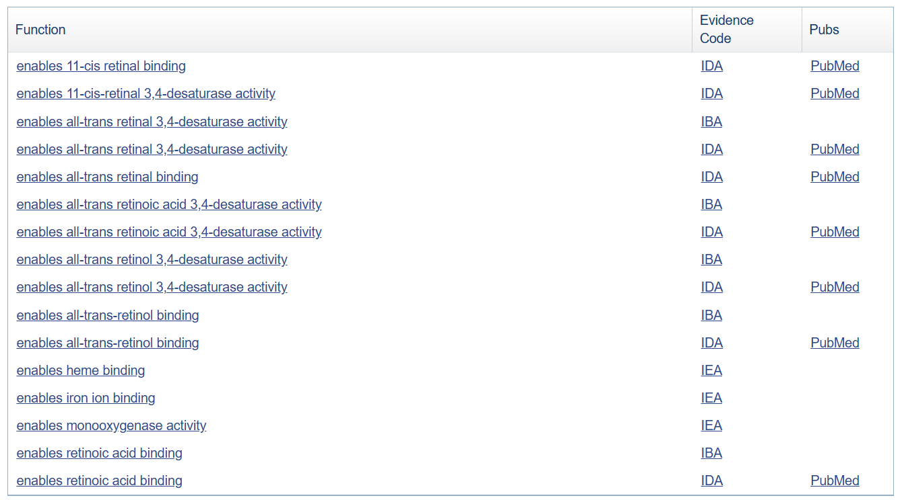

<!-- page number pos -->
\fancyhf{}
\fancyfoot[C]{\thepage}
\pagestyle{fancy}

<!-- no page nr on first page  -->
\pagenumbering{gobble}

<!-- Anger sidbrytning -->
\clearpage

<!-- creating the table of contents -->
\setcounter{tocdepth}{3}
\tableofcontents

<!-- new page -->
\clearpage

<!-- starting the count on 1 after the contents -->
\pagenumbering{arabic}
\setcounter{page}{1}

```{r setup, include=FALSE, echo = FALSE}
knitr::opts_chunk$set(echo = TRUE, message = FALSE, warning=FALSE)

suppressPackageStartupMessages({
    library(airway)
    library(DESeq2)
    library(ggplot2)
    library(org.Hs.eg.db)
    library(ALL)
    library(GEOquery)
    library(affyPLM)
})
```

# Question 1

*Run all the R code and reproduce the graphics. Go carefully through the R code and explain in your words what each step does.*
*_HINT_ Recall what a design/model matrix is from linear regression.*

```{r, cache = TRUE}
## ------------------------------------------------------------------------
library(GEOquery)
library(R.utils)
#x = getGEOSuppFiles("GSE20986")
#untar("GSE20986/GSE20986_RAW.tar", exdir = "data")

library(affy)
path <- "C:/Users/wountain/Desktop/SCHOOL/HT24_Bioinformatics/Bioinformatics/lab 4/data"
fns <- list.celfiles(path, full.name = TRUE)
celfiles <- read.affybatch(celfile.path = fns)
celfiles$Targets <- c("iris", "retina", "retina", "iris", "retina", "iris", "choroid", 
                      "choroid", "choroid", "huvec", "huvec", "huvec")

phenodata <- matrix(c(list.celfiles(path),
                      list.celfiles(path),
                      c("iris", "retina", "retina", "iris", "retina", "iris", "choroid", 
                        "choroid", "choroid", "huvec", "huvec", "huvec")), ncol = 3)
colnames(phenodata) <- c("Name", "FileName", "Targets")

boxplot(x = celfiles, las = 2)
```

In this chunk, data is processed and prepared for analysis. The microarray .CEL files are read into an AffyBatch class and the phenodata is created with class labels. Finally, the boxplot showing the intensity values for all samples is plotted.


```{r}
library(RColorBrewer)
cols = brewer.pal(8, "Set1")
eset <- exprs(celfiles)
samples <- celfiles$Targets
#colnames(eset)
colnames(eset) <- samples

boxplot(celfiles, col = cols, las = 2)
```

Extract the raw expressions (or intensities) from the .CEL-files in the AffyBatch class into a large matrix. Also use the targets in the phenodata object to name samples and set these as column names for the intensities. The boxplot shown is the same as the previous one but uses the defined color palette for a more visually appealing plot.


```{r}
distance <- dist(t(eset), method = "maximum")
clusters <- hclust(distance)
plot(clusters)
```

Calculate the sample distances and visualize the different intensity columns for the expressions as a hierarchical cluster according to maximum distance. Plot the resulting dendrogram with samples grouped based on similarity, branch lengths indicating differences and using the class labels as tips.


```{r, cache = TRUE}
## ------------------------------------------------------------------------
celfiles.gcrma = gcrma(celfiles)
par(mfrow=c(1,2))
boxplot(celfiles.gcrma, col = cols, las = 2, main = "Post-Normalization");
boxplot(celfiles, col = cols, las = 2, main = "Pre-Normalization")
```

Applies Robust Multi-Array Average on the AffyBatch to convert it into an expression, which normalizes intensities across the samples. Then plot the boxplots again, showing the already shown one but also the one post-normalization to showcase how the normalization was succesful.


```{r}
#dev.off()

distance <- dist(t(exprs(celfiles.gcrma)), method = "maximum")
clusters <- hclust(distance)
plot(clusters)
```

Performs a similar hierarchical clustering as before, but this time on the normalized intensities. This still has the .CEL files as tips.


```{r}
## ------------------------------------------------------------------------
library(limma)
                    
samples <- as.factor(samples)
design <- model.matrix(~0+samples)
colnames(design) <- c("choroid", "huvec", "iris", "retina")
design
```

This code uses the limma package which is used for the analysis of gene expression microarray data, especially for linear models and analysing designed experiments. The samples i.e. the class labels are converted to factor values so they are treated as groups. Then a design matrix is created with the intercept removed where rows represent the data samples and columns represent the different groups. A 1 in the design matrix indicates the data belonging to that group and vice versa for a 0. The factors are named according to labels and then the design matrix is printed.


```{r}
contrast.matrix = makeContrasts(
              huvec_choroid = huvec - choroid, 
              huvec_retina = huvec - retina, 
              huvec_iris = huvec - iris, 
              levels = design)

fit = lmFit(celfiles.gcrma, design)
huvec_fit <- contrasts.fit(fit, contrast.matrix)
huvec_ebay <- eBayes(huvec_fit)

library(hgu133plus2.db)
library(annotate)
probenames.list <- rownames(topTable(huvec_ebay, number = 100000))
getsymbols <- getSYMBOL(probenames.list, "hgu133plus2")
results <- topTable(huvec_ebay, number = 100000, coef = "huvec_choroid")
results <- cbind(results, getsymbols)

## ------------------------------------------------------------------------
summary(results)
```

Contrasts between groups are created between huvec and all other groups according to the design matrix. Then a linear model is fit to the normalized data based on the design matrix. The fit linear model is then used to compute the estimated coefficients and standard errors for the created contrasts, and then empirical Bayes statistics for this differential expression is computed e.g. t-statistics, F-statistics and log-odds of the differential expression. 

The names of the top genes in the differentially expressed probes from the linear model fit is extracted and mapped to gene symbols for easier interpretation. Then the coefficients for the huvec_choroid is extracted and the annotated summary is printed.


```{r}
results$threshold <- "1"
a <- subset(results, adj.P.Val < 0.05 & logFC > 5)
results[rownames(a), "threshold"] <- "2"
b <- subset(results, adj.P.Val < 0.05 & logFC < -5)
results[rownames(b), "threshold"] <- "3"
table(results$threshold)
```

Add a threshold to the results dataframe with the summary statistics for every probe. Every statisically significant gene with a high log fold change (logFC) get threshold 2, every significant with a low log fold change gets threshold 3. All other are thresholded as 1. The print shows the resulting thresholds for every category. The significance aids in identifying relevant changes in the distribution of genes.


```{r}
## ------------------------------------------------------------------------
library(ggplot2)
volcano <- ggplot(data = results, 
                  aes(x = logFC, y = -1*log10(adj.P.Val), 
                      colour = threshold, 
                      label = getsymbols))

volcano <- volcano + 
  geom_point() + 
  scale_color_manual(values = c("black", "red", "green"), 
                     labels = c("Not Significant", "Upregulated", "Downregulated"), 
                     name = "Key/Legend")

volcano + 
  geom_text(data = subset(results, logFC > 5 & -1*log10(adj.P.Val) > 5), 
            aes(x = logFC, y = -1*log10(adj.P.Val), colour = threshold, label = getsymbols)  )

```

A ggplot object is initialized with the log fold change on the x-axis. On the y-axis is a negative logged transformation of the adjusted p-value from the results statistics for the probes. The points are colored according to their threshold created earlier, and labeled in the legend according to not being significant, positive logFC (upregulated) or negative logFC (downregulated). Text is added to the genes with high upregulation and high negative log adjusted p-value.

# Question 2

*In the presented analysis, there are no plots of raw paired data. In the section where the contrasts are defined find the three contrasts. Present the variables versus each other original, log-scaled and MA-plot for each considered pair both before and after normalization. A cluster analysis is performed on the page but not reported. Present plots and also draw heatmaps.*
  
```{r}
contrast.matrix

# post-normalization
fit = lmFit(celfiles.gcrma, design)

# pre-normalization
unfit = lmFit(celfiles, design)
```

## Variables versus each other 

```{r}
# log transform with +1 to avoid nulls
log_eset <- log(eset+1)

# extract out all labels from data for normal and log data
choroid <- eset[, samples == "choroid"]
huvec <- eset[, samples == "huvec"]
iris <- eset[, samples == "iris"]
retina <- eset[, samples == "retina"]

log_choroid <- log_eset[, samples == "choroid"]
log_huvec <- log_eset[, samples == "huvec"]
log_iris <- log_eset[, samples == "iris"]
log_retina <- log_eset[, samples == "retina"]
```

### Choroid vs Huvec

```{r, cache = TRUE, fig.height = 7}
par(mfrow = c(2,1))
plot(choroid, huvec, ylab = "huvec", xlab = "choroid", main = "Original");
plot(log_choroid, log_huvec, ylab = "huvec", xlab = "choroid", main = "Log")
```

Log transforming data reduces absolute distances and show that Choroid and Huvec have largely very similar values, but there is a slight positive correlation amongst the variables.

### Choroid vs Iris

```{r, cache = TRUE, fig.height = 7}
par(mfrow = c(2,1))
plot(choroid, iris, ylab = "iris", xlab = "choroid", main = "Original");
plot(log_choroid, log_iris, ylab = "iris", xlab = "choroid", main = "Log")
```

Iris has many 0 value expressions. Those that are non-zero seem to share a positive correlation with Choroid.

### Choroid vs Retina

```{r, cache = TRUE, fig.height = 7}
par(mfrow = c(2,1))
plot(choroid, retina, ylab = "retina", xlab = "choroid", main = "Original");
plot(log_choroid, log_retina, ylab = "retina", xlab = "choroid", main = "Log")
```

Choroid and retina share a positive correlation amongst each other.

### Huvec vs Iris

```{r, cache = TRUE, fig.height = 7}
par(mfrow = c(2,1))
plot(huvec, iris, ylab = "iris", xlab = "huvec", main = "Original");
plot(log_huvec, log_iris, ylab = "iris", xlab = "huvec", main = "Log")
```

Again, the many zero values of Iris are shown. Otherwise the variables are distributed similarly but with a slight positive correlation.

### Huvec vs Retina

```{r, cache = TRUE, fig.height = 7}
par(mfrow = c(2,1))
plot(huvec, retina, ylab = "retina", xlab = "huvec", main = "Original");
plot(log_huvec, log_retina, ylab = "retina", xlab = "huvec", main = "Log")
```

Variables are distributed largely the same, a few outliers that are very separated from the rest of the group. However, the other variables are distributed similarly with a positive correlation.

### Iris vs Retina

```{r, cache = TRUE, fig.height = 7}
par(mfrow = c(2,1))
plot(iris, retina, ylab = "retina", xlab = "iris", main = "Original");
plot(log_iris, log_retina, ylab = "retina", xlab = "iris", main = "Log")
```

The variables seem to share a positive correlation except for the 0 values.

## MA-plots

### Pre-normalization

```{r, cache = TRUE}
par(mfrow = c(2,2))
limma::plotMA(unfit, coef = "choroid", main = "Choroid")
limma::plotMA(unfit, coef = "huvec", main = "Huvec")
limma::plotMA(unfit, coef = "iris", main = "Iris")
limma::plotMA(unfit, coef = "retina", main = "Retina")
```

The MA-plots for every variable show a strong positive correlation. This indicates that the expression levels in the genes are consistent across the samples. This means there are few significant differential expression changes and the overall gene expressions are similar.


## Post-normalization


```{r, cache = TRUE}
par(mfrow = c(2,2))
limma::plotMA(fit, coef = "choroid", main = "Choroid")
limma::plotMA(fit, coef = "huvec", main = "Huvec")
limma::plotMA(fit, coef = "iris", main = "Iris")
limma::plotMA(fit, coef = "retina", main = "Retina")
```

Normalization has increased the correlation of the distributions, meaning the gene expression are even more similar. This makes sense after normalization as it should all be on the same scale and thus more comparable.

## Cluster plots

### Pre-normalization

```{r}
distance <- dist(t(eset), method = "maximum")
clusters <- hclust(distance)
plot(clusters, main = "Cluster dendrogram pre-normalization")
```

```{r}
heatmap(as.matrix(distance))
```

Huvec and Retina seem to be close to each other, while Iris and Choroid are more similar. Meanwhile, the left most group of huvec and retina are far away from the other groups. The heatmap show this as well, with the dark intense color for those groups far away.

### Post-normalization

```{r}
distance_norm <- dist(t(exprs(celfiles.gcrma)), method = "maximum")
clusters_norm <- hclust(distance_norm)
plot(clusters_norm, main = "Cluster dendogram post-normalization", labels = phenodata[,3])
```

```{r}
heatmap(as.matrix(distance_norm), labRow = phenodata[,3], labCol = phenodata[,3])
```


Normalization has changed the clusters around. Huvec are now close to each other and no other gene. Retina, Iris, and choroid are instead more similar and close to each other in the dendrogram. The heatmap shows that the normalization has closed the distance between the same gene groups, but that the distance from the other genes are now more far away than they (comparatively) were pre-normalization, which represents the relationships better. Also the clear distinction of Huvec from the other ones.


# Question 3

*The volcano plot is only for huvec versus choroid. Provide volcano plots for the other pairs. Indicate significantly differentially expressed genes. Explain how they are found.*
  
## Huvec vs Iris
  
```{r}
results_iris <- topTable(huvec_ebay, number = 100000, coef = "huvec_iris")
results_iris <- cbind(results_iris, getsymbols)

results_iris$threshold <- "1"
a <- subset(results_iris, adj.P.Val < 0.05 & logFC > 5)
results_iris[rownames(a), "threshold"] <- "2"
b <- subset(results_iris, adj.P.Val < 0.05 & logFC < -5)
results_iris[rownames(b), "threshold"] <- "3"
#table(results_iris$threshold)

volcano <- ggplot(data = results_iris, 
                  aes(x = logFC, y = -1*log10(adj.P.Val), 
                      colour = threshold, 
                      label = getsymbols))

volcano <- volcano + 
  geom_point() + 
  scale_color_manual(values = c("black", "red", "green"), 
                     labels = c("Not Significant", "Upregulated", "Downregulated"), 
                     name = "Key/Legend")

volcano + 
  geom_text(data = subset(results_iris, logFC > 5 & -1*log10(adj.P.Val) > 5), 
            aes(x = logFC, y = -1*log10(adj.P.Val), colour = threshold, label = getsymbols)  )


```

## Huvec vs Retina

```{r}
results_retina <- topTable(huvec_ebay, number = 100000, coef = "huvec_retina")
results_retina <- cbind(results_retina, getsymbols)

results_retina$threshold <- "1"
a <- subset(results_retina, adj.P.Val < 0.05 & logFC > 5)
results_retina[rownames(a), "threshold"] <- "2"
b <- subset(results_retina, adj.P.Val < 0.05 & logFC < -5)
results_retina[rownames(b), "threshold"] <- "3"
#table(results_iris$threshold)

volcano <- ggplot(data = results_retina, 
                  aes(x = logFC, y = -1*log10(adj.P.Val), 
                      colour = threshold, 
                      label = getsymbols))

volcano <- volcano + 
  geom_point() + 
  scale_color_manual(values = c("black", "red", "green"), 
                     labels = c("Not Significant", "Upregulated", "Downregulated"), 
                     name = "Key/Legend")

volcano + 
  geom_text(data = subset(results_retina, logFC > 5 & -1*log10(adj.P.Val) > 5), 
            aes(x = logFC, y = -1*log10(adj.P.Val), colour = threshold, label = getsymbols)  )


```

The significantly differentially expressed genes are found by first proccessing microarray experiments with GCRMA and setting up a design matrix where each row represent a sample and columns a group. After that a linear model is fitted on the normalized data and contrasts between groups like 'huvec - retina' are defined to allow for comparison of gene expression levels between specific groups. 

Then the statistical testing starts with contrast.fit, where the contrast is applied on the linear model to focus on the wanted groups. Empirical bayes adjustment is used to account for the variability in the data, improving reliability of the estimates. The function 'topTable' is then used to extract the wanted results for the contrasts including 'logFC' to indicate the magnitude of the differential expression and 'adj.P.Val' to adjust the p-value for  multiple testing. We then apply thresholds for significance, where adjusted P-values less then 0.05 and logFC larger than 5 is Upregulated genes and adjusted P-values less than 0.05 but with logFC less than -5 are Downregulated genes. -1$\cdot$log10(adj.P.Val) is used to make really small adjusted P-values to stand out in the plots. The significant genes of interest (logFC > 5 & -1$\cdot$log10(adj.P.Val)) > 5) have their names printed in the plots, and not all significant genes as they are visualized with color. 

# Question 4

*Try to find more information on the genes that are reported to be significantly differentially expressed. The place to start off is https://www.ncbi.nlm.nih.gov/gene/, remember that the data is from the species human. Try to look also for other databases where (some) information on the genes may be found. Try to follow on some of the provided links. Report in your own words on what you find.*

*Report all the Gene Ontology (GO) terms associated with each gene. Are any of the GO terms common between genes? If so do the common GO terms seem to be related to anything particular? Try to present GO analysis in an informative manner, if possible visualize.*

```{r}
# getting significant and with names printed for all pairs
index1 <- which(results$logFC > 5 & -1*log10(results$adj.P.Val) > 5)
index2 <- which(results_iris$logFC > 5 & -1*log10(results_iris$adj.P.Val) > 5)
index3 <- which(results_retina$logFC > 5 & -1*log10(results_retina$adj.P.Val) > 5)

# one index without couplicates
index <- unique(c(index1,index2,index3))
unique(results$getsymbols[index])
```


*Other databases:*

https://www.genecards.org/

This database seems to use data from RefSeq, jul 2008.

One of the significant genes are without any name in getsymbols <- getSYMBOL(probenames.list, "hgu133plus2").


## HOXB7 - homeobox B7

A member of the homeobox family, located on chromosome 17. Increased expressions of the gene is associated with some cases pf melanoma and ovarian carcinoma. Broad expressions in kidney, colon, fat etc.

Diseases associated with it include Barrett Esophagus(can become cancerous) and Bilateral Renal Aplasia(kidney development). 


## GPR37 - G Protein-Coupled Receptor 37

G protein-coupled receptor faimly, contaisn seven transmembrane domains, involved in translating outside signals into G protein mediated intracellular effects. Biased expressions in brain and testis, interacts with Parkin and is involved in juvenile Parkinson disease. Also associated with Autism Spectrum Disorder.


## ALDH1A2 -  Aldehyde Dehydrogenase 1 Family Member A2

The protein belongs to the aldehyde dehydrogenase family, the product of the gene is an enzyme which catalyzes the synthesis of the active derivative of vitamine A(retinol), which is a hormonal signal molecule to develop adult tissues. Biased expression in endometrium and testis. 
Assiciated with diseases included Diaphragmatic Hernia 4, with Cardiovascular Defects(birth defect, affects breathing) and Renal Hypodysplasia/aplasia 1(anomalies of kidney and urinary tract).


## IL1RL1

A member of the interluekin 1 receptor family, similar to gene in mouse that studies suggest induce proinflammatory stimuli(immune system).
Biased expression in placenta. Associated with Chicken egg allergy and Conjunctivitis(pink eye).


## HOXA5 - homeobox A5

Encodes the class of homeobox genes that are found in 4 clusters, A, B C and D on four seperate chromosomes. The expressions of these proteins is spatially and temporally regulated during embryonic development. Biased expression in adrenal and lungs.
Diseases associated with HOXA5 include Embryonal Carcinoma(fast-growing testicle-tumor) and Mediastinal Gray Zone Lymphoma(cancer in the a part of the chest).


## HOXB6 homeobox B6

Member of the Antp homeobox family, included in a cluster of homeobox B genes in chromosome 17. Involved in development of lung and skin, biased expression in kidney and colon. Seems similar to Homeobox B7 with many of it traits. 
Diseases associated with HOXB6 include Hypospadias(opening of the urethra is not at the tip of the penis) and Myeloid Leukemia(type of bone marrow cancer).


## GABBR2 - gamma-aminobutyric acid type B receptor subunit 2 

Belongs to the G-protein coupled receptor 3 family and GABA-B receptor subfamily. Allelic variants of this gene have been associated with nikotine dependence. Restricted expression toward brain. 
Diseases associated with GABBR2 include Neurodevelopmental Disorder With Poor Language And Loss Of Hand Skills.


## SOCS2 -suppressor of cytokine signaling 2

This gene encodes a member of the suppressor of cytokine signaling (SOCS) family.
Broad expression in endometrium, prostate and adrenal etc. 
Diseases associated with SOCS2 include Hematologic(blood) Cancer and Polycythemia Vera(blood disorder, too many red blood cells).


## CCNK - cyclin  k

The protein encoded by this gene is a member of the transcription cyclin family.
Ubiquitous expression in bone marrow and testis etc.
Diseases associated with CCNK include Intellectual Developmental Disorder With Hypertelorism And Distinctive Facies(severe intellectual disability) and Kaposi Sarcoma(cancer in cells that line lymph and blood vessels).


## CYP27C1 - cytochrome P450 family 27 subfamily C member 1

This gene encodes a member of the cytochrome P450 superfamily of enzymes. Biased expression in skin and urinary bladder.
Diseases associated with CYP27C1 include Keratomalacia(eye disorder, often caused by low intake of the protein) and X-Linked Sideroblastic Anemia With Ataxia(smaller and paler red blood cells, less oxygen carried on the blood).



## GBGT1 - globoside alpha-1,3-N-acetylgalactosaminyltransferase 1

This gene encodes a glycosyltransferase that plays a role in the synthesis of Forssman glycolipid (FG), a member of the globoseries glycolipid family. Ubiquitous expression in placenta and appendix etc.
Diseases associated with GBGT1 include Niemann-Pick Disease, Type C1(loses function to move and use cholestrol nd ther lipids in cels) and Hyperinsulinemic Hypoglycemia, Familial, 7(insulin, low blood sugar).


## RASGRF2 - Ras protein specific guanine nucleotide releasing factor 2

RAS GTPases cycle between an inactive GDP-bound state and an active GTP-bound state. Broad expression in brain and ovary etc. 
Diseases associated with RASGRF2 include Autism Spectrum Disorder(same as GPR37).


## Summary of similarities

Some common GO terms:

* Developmental Processes: Homeobox genes like HOXB7, HOXA5, and HOXB6 share roles in embryonic development and tissue differentiation.

* Signal Transduction: Genes such as GPR37, GABBR2 are integral to G-protein coupled receptor signaling.

* Metabolic and Biosynthetic Functions: ALDH1A2 and CYP27C1 are critical for vitamin A metabolism and other biochemical pathways.

* Immune Responses: IL1RL1 and SOCS2 are linked to cytokine signaling and inflammation regulation.

```{r, fig.height = 7}
# Load necessary libraries
library(igraph)

# List with some Go terms (not all)
go_terms <- list(
  "DNA-binding transcription activator" = c("HOXB7","HOXA5"),
  "DNA-binding transcription factor activity" = c("HOXB7","HOXA5","HOXB6"),
  "Protein Binding" = c("HOXB7","GPR37","IL1RL1","HOXA5","HOXB6","GABBR2","SOCS2","CCNK"),
  "G protein-coupled peptide receptor" = c('GPR37','GABBR2'),
  "Nueropeptide binding" = c("GPR37"),
  "Retinal binding" = c("ALDH1A2","CYP27C1"),
  "Cytokine receptor activity/binding" = c("IL1RL1","SOCS2"),
  "Metal ion binding"=c('GBGT1')
)

# Convert the list to a data frame
go_terms_df <- do.call(rbind, lapply(names(go_terms), function(term) {
  data.frame(
    GO_Term = term,
    Gene = go_terms[[term]]
  )
}))

# Create the graph
graph <- graph_from_data_frame(go_terms_df, directed = FALSE)

# Set node types (GO Terms vs Genes) on the Vertices 
V(graph)$type <- ifelse(V(graph)$name %in% names(go_terms), "GO Term", "Gene")

# Set colors for nodes
V(graph)$color <- ifelse(V(graph)$type == "GO Term", "purple", "green")

plot(
  graph, 
  vertex.color = V(graph)$color,
  vertex.label.cex = 0.8,
  vertex.size = 25,
  edge.color = "gray",
  main = "Network of Genes and some of their shared GO Terms"
)

```
