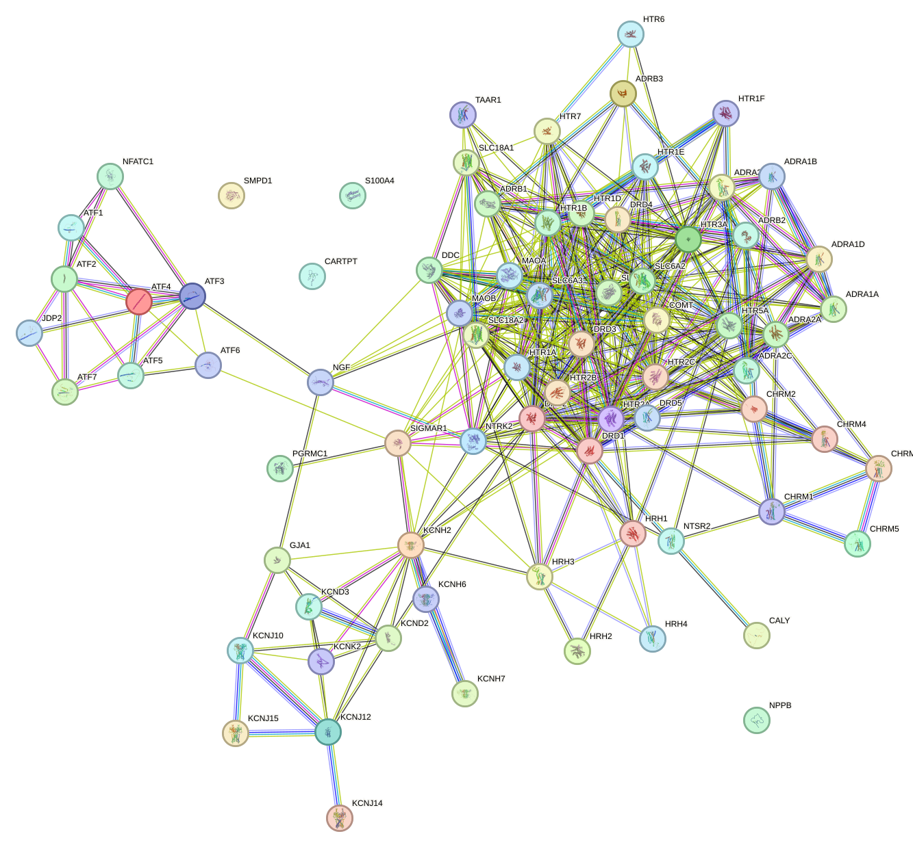

<!-- page number pos -->
\fancyhf{}
\fancyfoot[C]{\thepage}
\pagestyle{fancy}

<!-- no page nr on first page  -->
\pagenumbering{gobble}

<!-- Anger sidbrytning -->
\clearpage

<!-- creating the table of contents -->
\setcounter{tocdepth}{3}
\tableofcontents

<!-- new page -->
\clearpage

<!-- starting the count on 1 after the contents -->
\pagenumbering{arabic}
\setcounter{page}{1}

```{r setup, include=FALSE}
knitr::opts_chunk$set(echo = TRUE, message = FALSE, warning=FALSE, fig.width = 6, fig.height = 4)
library(tidyverse)
library(igraph)
```

# Question 1

1. *Go to the webpage http://snap.stanford.edu/biodata/ and choose one of the provided datasets. Download it and reproduce the statistics concerning the graph. If you obtain different values, then discuss this in your report. Visualize the graph.* 

```{r}
data <- read.table("ChG-Miner_miner-chem-gene.tsv", header = FALSE)
colnames(data) <- c("drug","gene")
# create graph
graph <- graph_from_data_frame(data, directed = FALSE)

total_nodes <- vcount(graph)
drug_nodes <- as.numeric(length(unique(data$drug)))
gene_nodes <- as.numeric(length(unique(data$gene)))
edges <- ecount(graph)

# strongest connected components
scc <- largest_component(graph)
nodes_scc <- vcount(scc)
nodes_fraction <- nodes_scc/total_nodes # not identical to bioSNAP
edges_scc <- ecount(scc)
edges_fraction <- edges_scc/edges

graph_diameter <- diameter(graph, directed = FALSE) # not identical to bioSNAP
graph_dist <- distances(graph) # get all distances
graph_dist <- as.vector(graph_dist[graph_dist < Inf]) # remove unconnected nodes
effective_diameter <- quantile(graph_dist, probs = 0.9) # not identical to bioSNAP

summary_stats <- rbind(total_nodes, drug_nodes, gene_nodes, edges, nodes_scc,
                       nodes_fraction, edges_scc, edges_fraction,
                       graph_diameter, effective_diameter)
```

```{r, echo = FALSE}
summary_stats <- as.matrix(mapply(function(df,digits){
  formatC(df, format="f",digits =digits)
  },
  df = summary_stats, digits = c(0,0,0,0,0,6,0,6,3,3))
)

rownames(summary_stats) <- c("Nodes", "Drug nodes", "Gene nodes", "Edges",
                             "Nodes in largest SCC", "Fraction of nodes in largest SCC",
                             "Edges in largest SCC", "Fraction of edges in largest SCC",
                             "Diameter (longest shortest path)",
                             "90-percentile effective diameter")
colnames(summary_stats) <- "Dataset statistics"
knitr::kable(summary_stats, caption = "Summary statistics for chosen dataset")
```

\pagebreak

There are differences in the fraction of nodes in largest SCC, the longest shortest path and the 90-percentile effective diameter between the BioSNAP summary and the summary produced here. The differences are small, and the concrete statistics such as nodes and edges are the same, meaning the constructed graph is very similar but calculated differently. Most likely, the differences comes from choices of computation, such as the diameter being calculated with different algorithms which might handle edge cases in different ways. Also, the graph created here has been created as undirected, but perhaps extra information exists that could make it directed. The fraction of nodes in the largest SCC differ, while the fraction of edges in the largest SCC are identical, which means there is some difference in how the fraction is calculated in the BioSNAP database.

```{r, fig.height = 7, fig.width = 7}
set.seed(123456)
# set node types
V(graph)$type <- ifelse(V(graph)$name %in% data[,1], "Drug", "Gene")

# set colors for nodes
V(graph)$color <- ifelse(V(graph)$type == "Drug", "purple", "orange")

plot(
  graph, 
  vertex.color = V(graph)$color,
  vertex.size = 2,
  vertex.label=NA, 
  edge.color = "gray",
  edge.size = 0.01,
  main = "Network of drugs and genes"
)
```

The plotted graph above shows Drug nodes as purple and Gene nodes as orange. There is a large cluster in the center with a lot of close connectivity between groups, yet distances between nodes differ largely and it would probably be apt to create more clusters. Then there is a large ring outer circle of nodes that has no apparent edges connecting them. There are only Genes in the outer circle at least in this format, but there are also overlapping nodes. As there are a lot of nodes and edges there is hard to say anything regarding how nodes are connected and potential directions in the graph, which requires a more formal analysis.

For slightly more detail, here only the largest connected component is computed.

```{r, fig.height = 7, fig.width = 7}
set.seed(123456)
clusters <- components(graph) # find components

# largest component
largest_component <- induced_subgraph(graph, which(clusters$membership == which.max(clusters$csize)))

# set node types
V(largest_component)$type <- ifelse(V(largest_component)$name %in% data[,1], "Drug", "Gene")

# set colors for nodes
V(largest_component)$color <- ifelse(V(largest_component)$type == "Drug", "purple", "orange")

plot(
  largest_component, 
  vertex.color = V(largest_component)$color,
  vertex.size = 3,
  vertex.label=NA, 
  edge.color = "gray",
  edge.size = 0.01,
  main = "Network of largest connected drugs and genes"
)
```

There is still hard to decipher the network but shows a bit more structure, also a bit smaller for use of ease.


\pagebreak

2. *The next step is to try to identify some clusters (communities in the graph). You can follow the tutorial at https://psych-networks.com/r-tutorial-identify-communities-items-networks/ to achieve this. Once you have found some clusters, identify the elements in it and try to find information on this cluster. Is it related to some known biological phenomena? If you do not find anything, then document your search attempts. If it will not be possible to do this question on the whole downloaded graph, then you may take some sub-graph of it.*

To perform the cluster analysis the first step is to perform the Spinglass Algorithm from the linked webpage.

As the original graph isn't connected, which is a requirement for the algorithm, the largest component network will be used.
```{r}
is_connected(graph)
is_connected(largest_component)
```

The guide mentions that the spinglass algorithm can differ between runs, but often provide very similar results to the walktrap algorithm which is fairly deterministic. Due to the size of the network, only a single run of the spinglass algorithm will be run for the sake of compute time.

```{r, fig.height = 7, fig.width = 7}
set.seed(123456)
g <- largest_component
sgc <- cluster_spinglass(g)

# assign cluster memberships to vertices
V(g)$cluster <- sgc$membership

# assign colors to vertices depending on membership
colors <- rainbow(length(unique(sgc$membership)))
V(g)$color <- colors[V(g)$cluster]

plot(
  g, 
  vertex.color = V(g)$color,
  vertex.size = 3,
  vertex.label=NA, 
  edge.color = "gray",
  edge.size = 0.01,
  main = "Network of clustered drugs and genes"
)
```

As there are 25 different clusters which also are not very separated in the graph as they are highly connected to each other, some further subsampling will be performed.

```{r}
cluster_sizes <- table(sgc$membership)
cluster_sizes
```
Let's take a look at the biggest cluster

```{r, fig.height = 7, fig.width = 7}
cluster25 <- V(g)[sgc$membership == 25]
cluster25_graph <- induced_subgraph(g, cluster25)

# set node types
V(cluster25_graph)$type <- ifelse(V(cluster25_graph)$name %in% data[,1], "Drug", "Gene")

# set colors for nodes
V(cluster25_graph)$color <- ifelse(V(cluster25_graph)$type == "Drug", "purple", "orange")


plot(
  cluster25_graph, 
  #vertex.label = V(cluster25_graph)$name,
  vertex.size = 3,
  vertex.label=NA, 
  edge.color = "gray",
  edge.size = 0.01,
  main = "Network of biggest cluster of drugs and genes"
)
```

Cluster 25 is plotted above. Again, Drug nodes are colored purple and Gene nodes are colored orange. There is a big amount of drug nodes in this cluster compared to genes. Below follows the associated labels with the cluster.

```{r}
cluster25_vec <- V(cluster25_graph)$name
cluster25_vec
```

To analyze this, all proteins will be ran in the STRING database (https://string-db.org/).

First, extract all proteins into a list. This file is uploaded on the "multiple proteins" section on STRING (https://string-db.org/cgi/input?sessionId=bWLThyUmK3Hr&input_page_active_form=multiple_identifiers)

```{r}
genes <- cluster25_vec[!grepl("^D", cluster25_vec)]

#writeLines(genes, "cluster25_genes.txt")
```

The proteins are linked as follows,


Out of the 75 gene proteins, 35 are mentioned in a paper "Functional characterization of G-protein-coupled receptors: a bioinformatics approach" by Tovo-Rodrigues L, Roux A, Hutz MH, Rohde LA, Woods AS where they discuss how G protein-coupled receptors (GPCRs) involved in synaptic transmission have flexible regions that allow them to interact with other proteins and adapt to different functions. These regions are especially common in certain parts of the receptors and contain patterns important for protein regulation and forming connections. This flexibility and adaptability may play a key role in how the nervous system functions and adjusts to changes.


# Question 2

*Recreate one of the three analyses that can be found on https://strimmerlab.github.io/ software/genenet/index.html. Document and discuss all your steps. In the analyses there is the step where you select the edges to keep. There a particular criterion is chosen for edge inclusion. Vary this criterion and explore how the resulting clusters will differ with the changes. Take one found cluster, identify the elements in it and try to find information on this cluster. Is it related to some known biological phenomena? If you do not find anything, then document your search attempts.*

## E. coli data (Schäfer and Strimmer 2005)

```{r}
# Load GeneNet package

library("GeneNet")

data(ecoli)
dim(ecoli)
```

Loading tha dataset and its longitude data, with 120 variables measured at 9 different time points.


```{r}
#'
#' # Estimation of partial correlations

#' Estimate matrix of partial correlation using a shrinkage estimator:
pc = ggm.estimate.pcor(ecoli)
dim(pc)
```

This step estimates the partial correlation for all pairs of genes in the dataset using a shrinkage estimator to reduce variability en improve precision. The output will be a square matrix of partial correlations.


```{r}
#' Assign p-values, q-values and empirical posterior probabilities to all
#' 5151 potential edges in the network:
ecoli.edges = network.test.edges(pc, direct=TRUE, fdr=TRUE)
dim(ecoli.edges)
```

We use the network.test.edges function to assign p-values, q-values, and posterior probabilities to the potential edges in the network and save in a table

```{r}
#' The table lists all edges in the order strength of partial correlations:
ecoli.edges[1:5,]
```

This prints a lists the edges with the top 5 highest partial correlation value. 

```{r}
#'
#' # Decide which edges to include in the network

#' To obtain a graph you need to select top ranking edges according to 
#' a suitable criterion.  Here are some suggestions:
#'
#' 1. Use local fdr cutoff 0.2, i.e. include all edges with posterior 
#' probability of at least 0.8.
ecoli.net = extract.network(ecoli.edges)
dim(ecoli.net)
```

When using a local cutoff of 0.2 we get 125 significant edges, which is 2.43% of all possible in the network. The number of significant directions in the network is 17, this suggests that of all the potential directional relationships in the selected 125 significant edges, 13.6% were deemed significant

The method used here is called the False Discovery Rate(FDR).


```{r}
#' 2. Use local fdr cutoff 0.1, i.e. i.e. include all edges with posterior 
#' probability of at least 0.9.

ecoli.net = extract.network(ecoli.edges, cutoff.ggm=0.9, cutoff.dir=0.9)
dim(ecoli.net)
```

Include edges with a posterior probability of at least 0.9.


```{r}
#' 3. Include a fixed number of edges, say the 70 strongest edges
ecoli.net = extract.network(ecoli.edges, method.ggm="number", cutoff.ggm=70)
dim(ecoli.net)
```

Instead of using FDR, you can set a max number of edges and only include the strongest, number in in this example is 70. 


```{r}
#' 
#' Plot network

#' For plotting we use the graph and Rgraphviz packages from Bioconductor.
library("Rgraphviz") 

#' Create graph object from the list of edges:
node.labels = colnames(ecoli)
gr = network.make.graph(ecoli.net, node.labels, drop.singles=TRUE)
table(  edge.info(gr)$dir )
sort( node.degree(gr), decreasing=TRUE)


#' Set node and edge attributes for more beautiful graph plotting:
globalAttrs = list()
globalAttrs$edge = list(color = "black", lty = "solid", lwd = 1, arrowsize=1)
globalAttrs$node = list(fillcolor = "lightblue", shape = "ellipse", fixedsize = FALSE)
 
nodeAttrs = list()
nodeAttrs$fillcolor = c('sucA' = "yellow")

edi = edge.info(gr)
edgeAttrs = list()
edgeAttrs$dir = edi$dir # set edge directions 
edgeAttrs$lty = ifelse(edi$weight < 0, "dotted", "solid") # negative correlation -> dotted
edgeAttrs$color = ifelse(edi$dir == "none", "black", "red")
edgeAttrs$label = round(edi$weight, 2) # use partial correlation as edge labels

#+ fig.width=8, fig.height=7
plot(gr, attrs = globalAttrs, nodeAttrs = nodeAttrs, edgeAttrs = edgeAttrs, "fdp")


```


Visualizing the extracted network, to explore the structure, relationships and patterns between the genes.

The gene sucA is highlighted and it seems important as its the only gene that connects to some(sucD, atpG etc.) of the other genes in the network. It might have a significant biological relevance like being a hub gene or highly connected gene. 


### Varying the criterion 


```{r}
ecoli.net = extract.network(ecoli.edges,method.ggm="qval", cutoff.ggm=0.02, cutoff.dir=0.9)
dim(ecoli.net)
```

Changing the criterion for selecting significant partial correlations and significant directions, now going by q-value instead. Only picking edges with a q-value lower than 0.02.

Now we only get 48 significant edges and 3 of them are directed in the network. 


```{r}
#' 
#' Plot network

#' For plotting we use the graph and Rgraphviz packages from Bioconductor.
library("Rgraphviz") 

#' Create graph object from the list of edges:
node.labels = colnames(ecoli)
gr = network.make.graph(ecoli.net, node.labels, drop.singles=TRUE)
table(  edge.info(gr)$dir )
sort( node.degree(gr), decreasing=TRUE)


#' Set node and edge attributes for more beautiful graph plotting:
globalAttrs = list()
globalAttrs$edge = list(color = "black", lty = "solid", lwd = 1, arrowsize=1)
globalAttrs$node = list(fillcolor = "lightblue", shape = "ellipse", fixedsize = FALSE)
 
nodeAttrs = list()
nodeAttrs$fillcolor = c('sucA' = "yellow")

edi = edge.info(gr)
edgeAttrs = list()
edgeAttrs$dir = edi$dir # set edge directions 
edgeAttrs$lty = ifelse(edi$weight < 0, "dotted", "solid") # negative correlation -> dotted
edgeAttrs$color = ifelse(edi$dir == "none", "black", "red")
edgeAttrs$label = round(edi$weight, 2) # use partial correlation as edge labels

#+ fig.width=8, fig.height=7
plot(gr, attrs = globalAttrs, nodeAttrs = nodeAttrs, edgeAttrs = edgeAttrs, "fdp")


```


A cluster here could be asnA, lacY, lacA, b1583, lacZ as they are well connected to each other but no that much to other genes, only positive partial correlations within and half of the edges to other genes outside the cluster have negative partial correlation. 


### Cluster

The lac operon of three genes, lacY, lacA and lacZ, which is an operon that is required for the transport of metabolism of lactose in E-coli, so for these three to be in the same cluster seems logical. 

Asparagine synthetase A (AsnA) is an enzyme in E. coli that helps produce the amino acid asparagine. It does this by converting another amino acid, aspartate, into asparagine, using ammonia as part of the reaction. So its metabolic but not in the same way as the lac operons and E-coli have lots of genes with metabolic functions, but the function to produce asparagine is very specific to Asna.

Didn't manage to find anything that relates b1583(ynfB) to the other genes in the cluster.


